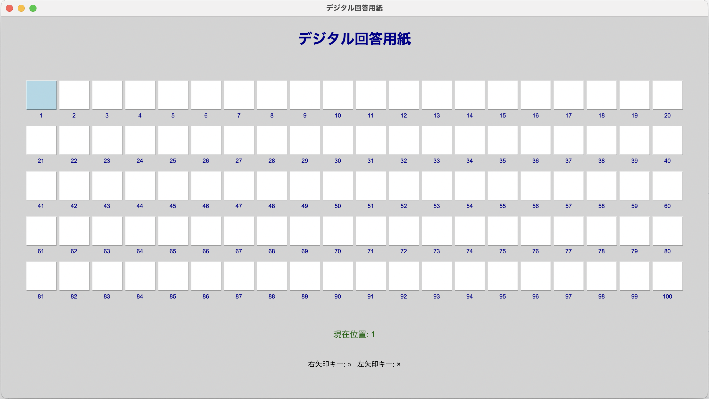

# デジタル回答用紙



## 概要
デジタル回答用紙は、問題を解く際にノートに書かずにデジタルで○×の回答を記録できるアプリケーションです。選択式問題や練習問題を解く際に、素早く効率的に回答を記録することができます。

## 特徴
- **100問対応**: 1〜100番までの問題に対応
- **視覚的な回答記録**: ○×マークで直感的に回答を記録
- **キーボード操作**: 矢印キーで素早い入力が可能
- **クリック移動**: 任意の問題をクリックして位置移動
- **現在位置表示**: 次に回答すべき問題がハイライト表示
- **回答修正**: 記入済みの問題も自由に修正可能
- **リセット機能**: ワンクリックで全ての回答をクリア

## 使用方法

### 基本操作
1. アプリケーションを起動します
2. キーボードの矢印キーで回答を入力します：
   - **右矢印キー (→)**: ○ を入力
   - **左矢印キー (←)**: × を入力
3. 入力すると自動的に次の問題に移動します
4. 任意の四角をクリックしてその問題に移動できます
5. 記入済みの問題も修正可能です
6. 「リセット」ボタンで全ての回答をクリアできます

### 画面の見方
- **白い四角**: 未回答の問題
- **青い四角**: 現在回答中の問題（記入済みでも青くハイライト）
- **黄色い四角**: 回答済みの問題（○または×が表示）
- **番号**: 各四角の下に問題番号（1〜100）が表示
- **現在位置**: 画面下部に現在の問題番号を表示

### 高度な操作
- **問題間移動**: 任意の四角をクリックしてその問題に瞬時に移動
- **回答修正**: 記入済みの問題をクリックして回答を変更
- **自由な順番**: 問題を飛ばして後から戻ることも可能

## 動作環境
- Python 3.7以上
- tkinter（Pythonの標準ライブラリ）

## インストール・実行方法

### 1. リポジトリのクローン
```bash
git clone <このリポジトリのURL>
cd digital-answer-sheet
```

### 2. 実行
```bash
python src/main.py
```

## 技術仕様
- **言語**: Python
- **GUI フレームワーク**: tkinter
- **画面サイズ**: 1200x750 ピクセル
- **対応問題数**: 100問（20問×5行）

## 使用場面
- 選択式テストの練習
- 問題集を解く際の回答記録
- 模擬試験の回答記録
- 学習進捗の可視化

## 利点
- **ペーパーレス**: 紙とペンが不要
- **高速入力**: キーボードによる素早い操作
- **柔軟な移動**: クリックで任意の問題に瞬時に移動
- **見やすい表示**: 色分けによる状態の視覚化
- **修正容易**: 記入済みの回答も簡単に変更
- **簡単リセット**: 間違えてもすぐにやり直し可能
- **環境に優しい**: 紙の消費を削減

## ライセンス
このプロジェクトはMITライセンスの下で公開されています。

## 作者
Accord33

## ファイル構成
```
digital-answer-sheet/
├── src/
│   └── main.py          # メインアプリケーション
├── assets/
│   └── screenshot.png   # アプリケーションのスクリーンショット
├── README.md            # このファイル
├── requirements.txt     # 依存関係（参考用）
├── pyproject.toml       # プロジェクト設定
├── uv.lock             # 依存関係ロックファイル
├── .gitignore          # Git無視ファイル設定
├── .python-version     # Python バージョン指定
└── .venv/              # 仮想環境（ローカル）
```

---
**デジタル回答用紙で効率的な学習を！**
